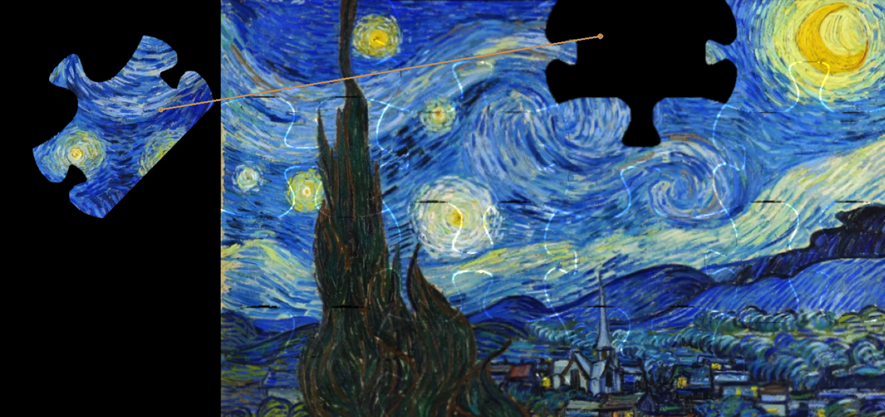

# Jigsaw Puzzle Solver
영상처리공학 팀프로젝트

- [Watching Demo Video](https://youtu.be/sCAlHI6r3fA?si=1TOsln96ofn6TA-a)

    


- Environment
    - Python : 3.6
    
    ```
    conda create -n puzzle_solver python=3.6
    ```
    
    ```
    pip install -r requirements.txt
    ```
    

- Dataset
    
    ```
    python -m dataset ./puzzle_images/ 2 &&\
    python -m dataset ./puzzle_images/ 3 &&\
    python -m dataset ./puzzle_images/ 4 &&\
    ```
    

- Demo
    
    ```
    python -m main demo ./puzzle_images/picture.png 4 
    ```
    

- Eval
    
    ```
    python -m main eval ./puzzle_images/ 
    ```
    
    - Result
        
        | Image_Name | The Number of Puzzles | F1-Score | mAP@0.85 |
        |------------|-----------------------|----------|----------|
        | picture    | 4                     | 1.0      | 1.0      |
        | picture    | 9                     | 1.0      | 1.0      |
        | picture    | 16                    | 1.0      | 1.0      |
        | chessboard | 4                     | 0.75     | 0.75     |
        | chessboard | 9                     | 0.43     | 0.11     |
        | chessboard | 16                    | 0.0      | 0.0      |
        | bulb       | 16                    | 0.5      | 0.25     |
        | bulb       | 4                     | 1.0      | 0.75     |
        | bulb       | 9                     | 0.75     | 0.67     |
        | cat        | 16                    | 0.81     | 0.81     |
        | cat        | 4                     | 1.0      | 1.0      |
        | cat        | 9                     | 1.0      | 1.0      |
        | building   | 4                     | 1.0      | 1.0      |
        | building   | 9                     | 1.0      | 1.0      |
        | building   | 16                    | 1.0      | 1.0      |
        | handmodel  | 16                    | 0.17     | 0.0      |
        | handmodel  | 9                     | 0.0      | 0.0      |
        | handmodel  | 4                     | 0.67     | 0.25     |
        | glasses    | 16                    | 1.0      | 1.0      |
        | glasses    | 4                     | 1.0      | 1.0      |
        | glasses    | 9                     | 1.0      | 1.0      |
        | harvest    | 4                     | 1.0      | 1.0      |
        | harvest    | 9                     | 1.0      | 0.44     |
        | harvest    | 16                    | 0.69     | 0.12     |
        | box        | 16                    | 0.73     | 0.25     |
        | box        | 9                     | 0.86     | 0.56     |
        | box        | 4                     | 1.0      | 1.0      |
        | ocean      | 9                     | 1.0      | 1.0      |
        | ocean      | 16                    | 0.94     | 0.94     |
        | ocean      | 4                     | 1.0      | 1.0      |
